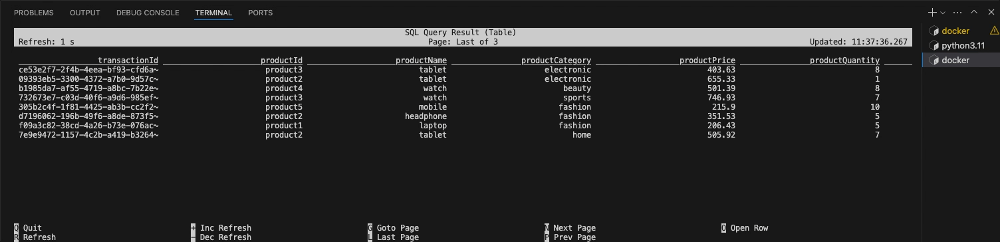

# Apache Kafka (Kraft, 2 Controller , 3 Broker), UI for Kafka and Apache Flink
This project comprises a setup containing Apache Kafka (Kraft mode) cluster with Real time data processing engine Apache Flink

The Kafka cluster is comprised of 2 Controllers + 3 Broker Nodes with UI for Apache Kafka for monitoring.

The Apache Flink is setup to connect to Apache kafka and exhibit the real-time processing capabilties.

This project also provides the neccesary scripts to generate ficticious transaction loads via Python.

# Overview

This project has got multiple features which will be explained below:

- It is important for the apache flink to be operating in a particular python version <= 3.11, hence the project uses pyenv `.python-version` for the local pyflink package installation.

- The folder pyflink is bind mounted to the job/task managers of the the apache flink in the location `/opt/flink/src/python` for local execution within the running docker container enabling devloper editing.  
This folder has got 2 example files (from Flink documentation)   
[word_count_data_stream.py](https://nightlies.apache.org/flink/flink-docs-release-2.0/docs/dev/python/datastream_tutorial/)  
[word_count_table_api.py](https://nightlies.apache.org/flink/flink-docs-release-2.0/docs/dev/python/table_api_tutorial/)  
 
The above files in the Job Manager container can be run as follows:   
`./bin/flink run --python /opt/flink/src/python/word_count.py`  
 
[Submitting PyFlink Jobs](https://nightlies.apache.org/flink/flink-docs-release-2.0/docs/deployment/cli/#submitting-pyflink-jobs)

- The folder `data` is bind mounted to the job/task manager container of the apache flink in the location `/opt/flink/data` for enabling demo of CSV data read and write examples.

- The folder `kafka` contains the data producer python scripts for live data geenration replication (sample based on transaction data).  
This folder has 2 files as follows:  
`producer.py`  
`sales_transaction_producer.py`  
The above 2 files can be ran in the local environment, connecting to the docker kafka container and pushing data into the topic as defined in the codebase.  
[Python Client for Apache Kafka](https://docs.confluent.io/kafka-clients/python/current/overview.html)

- The `Dockerfile` is used to build the image as apache flink (base) + kafka-sql-connector + pyflink  
 
The associated command to build the image is as follows:  
`docker build -t flink/custom:v1.0 .`

- The file setup the kafka cluster, is in its own YAML `kafka-compose.yaml` which can be used to setup and enable the kafka cluster only.  
 
The associated command to run particular compose file is as follows:  
`docker compose -f kafka-compose.yaml up`  
 
This will setup and independent kafka cluster with UI.  
[Docker - docker compose](https://docs.docker.com/reference/cli/docker/compose/#use--f-to-specify-the-name-and-path-of-one-or-more-compose-files)

- The above file is then included in the `compose.yaml` where the apache flink task/job manager. So the command `docker compose up` starts all the services as listed below:
    - Apache Kafka : 2 Controllers
    - Apache Kafka : 3 Brokers 
    - Apache Kafka : UI for Apache Kafka 
    - apache Flink : Job Manager
    - Apache Flink : Task Manager   
      If you like to add more task managers for Flink, one can use  
      `docker compose scale taskmanager=2`
    - Apache Flink : SQL Client (Stopped State)  
    This is an on-demand container which when user want to use the SQL commands to interact with flink and create jobs via SQL [Flink SQL Development](https://nightlies.apache.org/flink/flink-docs-release-2.0/docs/dev/table/sql/gettingstarted/)  
     
    `docker compose run sql-client`

    **Note:** There is a `KAFKA_CLUSTER_ID` being set in the compose file, to obtain the key intially one can follow the relevant article [Generate Intial Cluster ID for apache Kafka](https://sleeplessbeastie.eu/2021/10/22/how-to-generate-kafka-cluster-id/)

# Outcome

## Apache Kafka Messages

Generate Kafka Messages via Python

Messages validated in the Kafka UI

## Apache Flink Table (SQL Real-Time)

SQL Commands for Flink

Create Table from Kafka Topic (JSON)
~~~sql
CREATE TABLE KafkaTable (
  `transactionId` STRING,
  `productId` STRING,
  `productName` STRING,
  `productCategory` STRING,
  `productPrice` STRING,
  `productQuantity` STRING,
  `productBrand` STRING,
  `currency` STRING,
  `customerId` STRING,
  `transactionDate` STRING,
  `paymentMethod` STRING,
  `totalAmount` STRING,
  `ts` TIMESTAMP_LTZ(3) METADATA FROM 'timestamp'
) WITH (
  'connector' = 'kafka',
  'topic' = 'financial_transactions',
  'properties.bootstrap.servers' = 'broker-2:29095',
  'properties.group.id' = 'testGroup',
  'scan.startup.mode' = 'earliest-offset',
  'format' = 'json'
);
~~~

DROP the table if exists

~~~sql
DROP TABLE KafkaTable;
~~~

SELECT from the table (underlying kafka topic in broker)

~~~sql
Select * From KafkaTable;

EXIT; -- Use this command to exit the terminal and container
~~~

## Docker Overview

